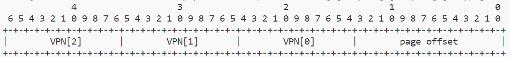

# ucore-based riscv operating system with 16k page size

项目地址：https://github.com/Trust04zh/16kos
项目成员：[@Trust_04zh](https://github.com/Trust04zh)、[@zly](https://github.com/zly7)

## 项目摘要

- [x] 设计并实现支持基于16k页面的虚拟内存管理系统的操作系统
  - [x] 验证系统正确性
- [x] 修改qemu提供16k页面操作系统的模拟运行环境
- [x] 实现基于页的空闲内存分配算法
  - [x] First Fit
  - [x] Best Fit
  - [x] Buddy System
- [x] 在16k页面操作系统上实现进程管理
  - [x] 实现用户进程间用户内存的隔离
- [] 解释`satp`更新后控制流能够正常执行的原理

## 项目说明

本项目基于SUSTech CS305/334课程提供的`RISC-V ISA`下的`ucore`操作系统代码进行更新，修改`qemu-5.0.0`以构建相应的模拟硬件环境，实现基于16KB大小的页面进行虚拟内存管理的操作系统，系统支持First Fit、Best Fit、Buddy System三种页分配算法，支持进程管理，每个用户进程通过各自的虚拟内存空间访问物理内存。

由于本项目中虚拟地址有效位数为47位——PTE中的三个分段和页偏移共四个段，各比`sv39`的设计长2位，本文中有时以`sv47`的说法指代我们的设计。

### 构建与运行

构建`qemu`环境与操作系统并运行

```shell
$ cd 16kos-qemu
$ make clean && make
$ cd ..
$ source setup_env.sh
$ make clean && make && make qemu 
```

使用`gdb`调试系统

```shell
$ make clean && make && make qemu-gdb  # listens on port 1234
```

### 16k os实现

本章节解释为使系统支持按16k大小分页，而非常规的4k分页，所进行的设计与代码实现。

#### qemu更新

在官网下载[`qemu-5.0.0`源代码包](https://download.qemu.org/qemu-5.0.0.tar.xz)，以`sv39`为关键字，在三个目录下可以找到相关宏定义，检查后发现其中`roms/u-boot/arch/riscv/include/asm`和`roms/opensbi/include/sbi`两个目录下的宏定义没有实际使用，故只需要关注`target/riscv`目录下的宏定义。

根据20211203版RISC-V特权指令集手册的说明，`satp`的高4位`MODE`段保留`14-15`两个值用于自定义模式，我们定义`sv47`占用`MODE`字段值`14`。我们在`qemu`中添加`sv47`模式的宏定义，声明该模式有效，并添加相应的支持。此外，检查发现`target/riscv/cpu_bits.h`文件中`PGSHIFT`宏在`qemu`中的地址转换实现中有使用到，这个值与`satp`中`MODE`字段无关地被设置为`12`，考虑到RISC-V所有基于页的虚拟内存管理系统都使用4k页倒也合理，这里我们将其设置为`14`。

根据[@yuki](https://github.com/yuk1i)同学的提醒，`target/riscv/cpu-param.h`文件中`TARGET_PAGE_BITS`宏也需要由`12`修改为`14`，检查发现另一个宏`TARGET_PAGE_SIZE`与其有关，该宏在代码中多处被引用。

#### VA格式

下图为虚拟地址格式图示



虚拟地址VA(Virtual Address)包括三段VPN(Virtual Page Number)和页偏移四个段。页面大小为`16kb = (1 << 14)b`，故页偏移长度为`14`，页表项大小为8字节，每页可以放置`16k >> 3 = 2k = (1 << 11)`个页表项，故三段VPN长度均为`11`，虚拟地址长度合计`11 + 11 + 11 + 14 = 47`，虚拟地址可以寻址`(1 << 47)b = 128tb`范围。

#### PA格式

下图为物理地址格式图示


物理地址PA(Physical Address)包括三段PPN(Physical Page Number)和页偏移四个段，其中PPN总长度为`44`，这是由页表项中`PPN`字段的长度决定的，二者相等。物理地址中`PPN[1]`、`PPN[0]`和页偏移三段与虚拟地址中相应的`VPN`和页偏移段长度相等，即`PPN[1]`和`PPN[0]`段长度为`11`，页偏移段长度为`14`，故`PPN[2]`长度为`44 - 11 - 11 = 22`。物理地址总长度为`22 + 11 + 11 + 14 = 58`，物理地址可以寻址`(1 << 58)b = 256pb`范围。

#### PTE/PDE格式

下图为PTE/PDE格式图示，在20211203版的特权指令集标准中高10位被分为3个保留段，其中两个分别给特定的指令集拓展使用。在这些拓展均没有实现时，高10位均应置0，我们的系统实现中只需要这样全部置0就可以，因此也不对这三个段作区分。


页表项PTE(Page Table Entry)与页目录项PDE(Page Directory Entry)每项大小仍为8字节，`PTE/PDE[9:0]`为标志位，`PTE/PDE[63:53]`为保留位，这与`sv39`的设计相同，不同之处在于`PTE/PDE[53:10]`这44位所表示的`PPN`的三个分段的分隔位置的改变，三段分别为`PTE/PDE[53:32]`，`PTE/PDE[31:21]`，`PTE/PDE[20:10]`，长度为`22 + 11 + 11 = 44`。PTE与PDE格式相同，区别方法在于后者`RWX`三个标志位均为`0`而前者不然。

#### 16k os 实现验证

##### 验证1：修改ucore内置检查函数验证页大小

`target/mm/swap.c`中的`check_content_set`函数构造了一组对虚拟地址的访问，并对page fault发生的次数进行断言，首次访问一个未分配的页时，会触发page fault分配物理页，使得计数加一，据此可以判断页的大小。对4k os的测试代码如下

```c
// ...
*(unsigned char *)0x1000 = 0x0a;
assert(pgfault_num==1);
*(unsigned char *)0x1010 = 0x0a;
assert(pgfault_num==1);
*(unsigned char *)0x2000 = 0x0b;
assert(pgfault_num==2);
// ...
```

4k os能通过完整测试，而在我们的16k os中进行该测试，会在第三条断言处报错，说明此时并没有发生新的page fault。我们修改测试访问的地址

```c
// ...
*(unsigned char *)0x4000 = 0x0a;
assert(pgfault_num==1);
*(unsigned char *)0x7fff = 0x0a;
assert(pgfault_num==1);
*(unsigned char *)0x8000 = 0x0b;
assert(pgfault_num==2);
// ...
```

在16k os中通过完整测试。每次访问之前没有访问过的16k大小的地址范围时，计数才加一，说明发生新的page fault，故我们认为页大小确实是16k。

##### 验证2：在qemu中添加调试输出验证地址转换正确性

通过检查`qemu`源代码中`target/riscv`目录下的代码，很容易发现用于VA到PA转换的函数`get_physical_address`，其中只有一个出口返回"转换成功"的信号，我们在这里输出`sapt`、VA、PA作为调试信息。

```c
// target/riscv/cpu_helper.c get_physical_address
printf("debug: get_physical_address: translate success\n");
printf("debug: get_physical_address: env->satp = 0x%016lx va = 0x%016lx pa = 0x%016lx\n", env->satp, addr, *physical);
return TRANSLATE_SUCCESS;
```

我们截取了一张调试信息输出，这里输出的`pa`是页基址。图中同时出现了用户态进程访问用户空间，和触发时钟中断后内核访问内核空间的情景，两者都通过虚拟地址正确地转换得到了物理地址，因此我们认为我们的16k os能够在修改后的`qemu`上正确地进行地址转换。


### 物理内存管理

空闲物理页内存管理由ucore实现，关键部分由`kern/mm/pmm.c`中`page_init`函数与`pmm_manager`具体实现的`init_memmap`函数实现，在`page_init`函数中对齐计算可用于构建空闲页的内存空间范围，并在`init_memmap`中构建相应的内核数据结构，通过对数据结构的维护实现对物理页的管理。

### 页分配算法

页分配算法定义了如何具体地维护上一节所述的数据结构。

#### First Fit

First Fit页分配算法由ucore实现在`kern/mm/default_pmm.c`中，算法在初始化时将所有的空闲页组按地址顺序维护在一个链表中，每个空闲页组包括连续的若干空闲页，需要分配空闲页时，算法找到链表中第一个满足需求页数目的空闲页组，并从中进行分配。需要回收页时，算法根据地址把回收的页组插入到链表中相应的位置，并检查是否能与前后的空闲页组进行合并。First Fit算法的验证由ucore内置。

#### Best Fit

我们将Best Fit页分配算法实现在`kern/mm/best_fit_pmm.c`中，该算法与Best Fit算法的区别在于，其在分配空闲页时选择的是最合适的——在满足需求页数目的前提下最小的——空闲页组，而不是第一个满足需求页数目的空闲页组。Best fit 算法基本扩展于First fit 算法.  Best Fit算法的验证主要进行与first fit 不同之处的验证， 在first fit验证算法上进行精简。

#### (Binary) Buddy System

我们将张教授上课教的算法实现在'kern/mm/buddy_pmm.c'中，其中维护1,2,4,8,16,32,64,128,256,512,1024 大小的连续页表的数组。每个数组的头列表都是一个free_area结构体，在之后连接属于这个大小的连续页面。每次alloc page 之时，先寻找到大于等于这个需求页面的大小，然后整块分配，把多余的页表还回数组中。在free页面的时候，需要考虑是否能和周围的页表项进行合并，然后升级。

在能否进行合并的判定上面。我们采取张教授所提示的依据物理地址或者物理页号的二进制位数结合掩码的形式判断，比如对于页表项大小是1，我们判定物理页面地址前（32-15）位是相同的即可合并。

在实现对于PAGE FLAG 的管理上面，我们采取和First fit相同的管理方式，是free page 并且是链表头部，我们会对应page SetPageProperty。

在对于free_area 的遗留问题，最开始我们使用page_link 链接相同大小的page, 但在之后发现free_area在别的地方比如swap的测试中有直接的使用，所以在后来在page struct中添加buddy_link属性，并且依旧在对buddy数组维护的过程中，依旧维护free_area所代表的free_page的链表。


对于buddy system 主要相比于First fit有更少的外碎片，对比Best fit 而buddy system能在大部分情况以O（1）的时间分配，尤其是在小页面分配需求比较多的情况下,而Best fit 往往在寻找到不错的解之后，依旧会搜寻整个空闲页表队列。


### 进程管理

多进程操作系统支持基于页的虚拟内存管理的关键在于，如何恰当地初始化与维护由`satp`维护的一级页表物理页号信息，和由结构体`mm_struct`维护的虚拟内存区域(VMA, Virtual Memory Area)信息。前者的切换实现了虚拟内存空间切换，后者维护了进程可访问的内存区域的信息。

进程管理由ucore实现，进程结构体均通过`kern/process/proc.c`中的`alloc_proc`创建，`satp`初始化为`boot_cr3`即我们在系统启动最开始写入到`satp`的物理页的基址，`mm`(`mm_struct`实例的指针)初始化为`NULL`。内核进程简单地根据`boot_cr3`设置`satp`，并且不创建新的`mm_struct`实例用于维护虚拟内存信息——其页表能够映射到所有有效的物理地址，内核进程可访问的内存也不需要VMA来约束。用户进程在`kern/process/proc.c`的`load_icode`函数中创建新的`mm_struct`实例并配置VMA信息，为一级页表分配内存页并添加对其基址信息的维护。

通过进程调度切换进程时，`satp`作为上下文更新，`mm`随着内核维护的当前进程结构体指针的更新而更新，从而实现了虚拟内存空间的正确切换。

#### 完全公平进程管理
我们对于CFS进程调度算法进行实现在'kern/schedule/cfs_shed.c',对比算法是轮转优先级直接调度算法，实现在'kern/schedule/rr_q_shed.c'. CFS算法其中核心的思想是通过所谓的优先级的设置来计算核心调度指标vruntime。优先级高的任务每次被调度的时间会更长，但是由于vruntime的存在，它的vruntime比较大，而每次我们在调度的时候会选择vruntime最小的那个，所以优先级高的任务被调度的可能性更小，被调度的次数也更少。所以在完全公平调度算法里面，所谓的优先级设置高或者低不会影响实际的运行时间。这个我们也通过ex3进行了测试，当我们把一个程序的所谓的优先级设置成50后，另外的优先级设置成1,2,3,4.最后5个进程几乎是在一起完成同样大小的任务，所以该调度算法最大保证了公平性。而如果是剥夺性优先级调度算法会完全先执行完优先级高的任务。如果是轮转优先级直接调度算法，会按照优先级线性分配时间片，也对低优先级任务不公平。


### 其他

这一章节用于记录一些项目设计与实现过程中我们认为有意思的点，结果上来说，实际的时间投入反而不少体现在这些琐碎的"点"上——尤其是本次项目的基础部分要求不少已经被ucore实现了，我们需要做的代码量并不算大的情况下。对这些内容的思考与探索也是让我们有所收获的。

#### 伪指令`la`相关的一个有趣表现

为了从没有虚拟内存管理切换到分页虚拟内存管理，我们做了一系列设计。

在`kern/init/entry.S`的`kern_entry`部分，ucore原有的实现通过`lui reg, %hi(symbol)`的方法取得符号(symbol)的高位，在`sv47`沿用这种做法会在链接时出现包含如下片段的报错

```plaintext
... relocation truncated to fit: R_RISCV_HI20 against symbol ...
```

查阅资料得知，`%hi`对操作符号的地址范围有所限制，因此需要用其他方法来获取符号地址。

我们使用`la reg, symbol`。`la`的作用是将符号地址载入到寄存器中，其作为伪指令，在汇编时翻译为真指令序列。由于我们在`kernel.ld`中将`BASE_ADDRESS`设置为高地址的虚拟地址值，乍看起来`la`似乎会加载得到虚拟地址，但查看汇编可以注意到`la`翻译得到的指令序列中出现的，用于得到符号相关的地址的关键指令`auipc`。由于内核代码实际加载在低地址的物理地址处，在我们在配置好虚拟内存管理并更新`pc`到虚拟地址——这件事会在我们跳至符号`kern_init`时发生，这个符号由于`BASE_ADDRESS`的设置而在高地址处——之前，`pc`维护的仍是低地址的物理地址。因而不同于ucore的`sv39`实现通过恰好的构造先得到虚拟地址，我们通过`la`取符号地址得到的是物理地址，如需要虚拟地址则对物理地址加上偏移量`0xffff_fff0_0000_0000`得到。

#### 启用分页后pc更新问题

我们在上一个问题的讨论中提到，无论是`sv39`还是`sv47`的实现，控制流刚进入内核时，`pc`的值是低地址的物理地址。当`satp`被更新后，只有我们预先设置的，虚拟地址空间地址最高的一个吉页(由一级页表中的页表项直接建立映射的页)是可以被访问的，但此时`pc`尚未更新为高地址的虚拟地址，此时`pc`应该在顺序执行指令的过程中访问到非法地址，导致程序异常退出。然而ucore的`sv39`实现能够正常运行，这已与我们的分析相违悖，不过我们确实找到了能够佐证我们这一分析的现象：使用gdb调试，在单步执行到`satp`的更新后，继续单步执行将导致gdb给出如下报错

```plaintext
Warning:
Cannot insert breakpoint 1: Cannot access memory at address 0x80200000

Command aborted.
```

这与我们的分析是相符的。

为了确认为什么在实际使用qemu模拟的过程中并没有出现这个问题，需要进一步地阅读qemu源代码。我们的一种猜想是这可能是由一种类似指令预取的机制实现的，但是这破坏了基于页的虚拟内存管理机制的内存保护功能，似乎应当视为一种"预测错误"。

不管怎么说，我们可以用一种更"优雅"的方式启用虚拟内存管理机制，在原有设计的基础上，我们将内核一级页表的第一项也布置为有效，并且虚拟地址与物理地址"直接映射"，即虚拟地址映射到相等的物理地址，使得启用分页机制后，仍维护物理地址的`pc`可以正常访问代码段，等效于维护了虚拟地址。在控制流跳转到`kern_init`后，`pc`已被更新为高地址的虚拟地址，我们再擦除"直接映射"的页表项使其无效，具体实现如下

```assembly
# kern/init/entry.S

# ...
boot_page_table_sv47:
  .quad 0xcf # VRWXAD  # invalid in previous design
  .zero 8 * ((1 << PGLEVEL_BITS) - 1 - 1)
  .quad 0xcf # VRWXAD
```

```c
// kern/init/init.c

int
kern_init(void) {
    extern uint64_t boot_page_table_sv47[];
    boot_page_table_sv47[0] = 0;
    // ...
}
```

这部分感谢[@cobalt-27](https://github.com/cobalt-27)同学与我们一同交流与查找资料。

#### 系统调用实现的更新

启用`sv47`后，我们在测试用户进程的运行时遭遇了一点阻碍，在通过`kern/process/proc.c`的`kernel_execve`函数发起`sys_execve`系统调用后发生了无法处理的page fault，经过一番调试，我们发现在作为参数传给系统调用的地址`0xffff_fff0_8xxx_xxxx`，在系统调用处理函数中变成了`0xffff_ffff_8xxx_xxxx`，怀疑是地址在某处发生了低32位截断再符号扩展，最终发现是其在内联汇编中布置系统调用的参数时使用的是`lw`而非`ld`。参数传递范围由32位改成64位可以得到更强的鲁棒性~~或者满足正确性？但它原来的实现应该也不能算错~~，在`sv39`实现中由于地址高32位`[63:32]`由第31位符号扩展得到的做法总是恰好是正确的，因而没有暴露问题。我们做如下代码修改后系统调用能够正常传递参数，问题得到解决。

```c
asm volatile(
        "li a0, %1\n"
        "ld a1, %2\n"  // previously "lw a1, %2\n"
        "ld a2, %3\n"  // previously "lw" too
        "ld a3, %4\n"  // ... too
        "ld a4, %5\n"  // ... too
    	  "li a7, 10\n"
        "ebreak\n"
        "sw a0, %0\n"
        : "=m"(ret)
        : "i"(SYS_exec), "m"(name), "m"(len), "m"(binary), "m"(size)
        : "memory");
```

看来课程lab给的代码里看来不少实现是从32位实现搬过来的，包括其内置的`print_trapframe`等调试输出函数也是按寄存器32位长度实现的。

在上面的内联汇编代码片段中，我们获取返回值用的仍然是`sw`而非`sd`，因为ucore的既有实现里系统调用处理函数的返回值类型，无论是内核实现还是用户库用的都是`int`，64位实现应该把这些`int`全部改成64位的数据类型，以使得一次系统调用能够传递64位的返回值如地址。~~考虑到这种纯体力劳动的填坑没什么意思干脆能用就行我们就没继续改了~~

## 参考资料

提到`%hi`取符号地址时地址范围的限制，我们测试发现不止在`code model`为默认的编译参数`-mcmodel=medlow`时存在这个限制，参数`-mcmodel=medany`时也有这个现象。
https://github.com/riscv-collab/riscv-gnu-toolchain/issues/103
